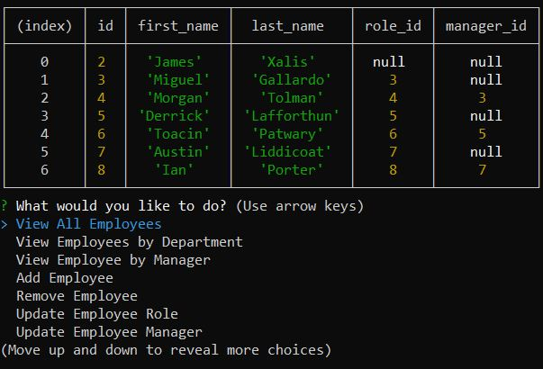
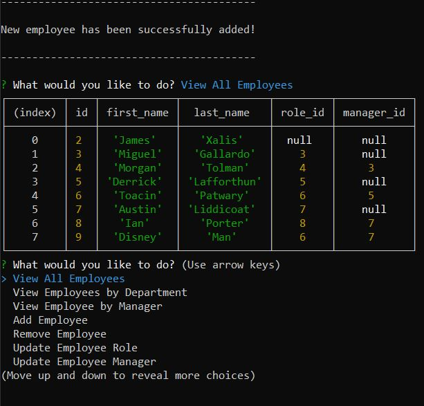

# Employee-Database-Interface

## Table of Contents
* [Description](##Description)
* [Technologies](##Technologies)
* [Demo](##Demo)
* [Screenshot](##Screenshot)
* [Installation](##Installation)
* [License](##License)
* [Questions](##Questions)

## Description

This node application is an Employee Database Interface with a robust suite of database management features. This database can keep track of departments, roles within those departments, and employees with said roles. Users are easily able to view information on any of the three aforementioned tables. Furthermore, the user can add/delete departments, roles, and employees, or simply update the role/manager of a current employee. See Demo below to see the full functionality of this application.

### Technologies

As this application runs on node, many of the foundational technologies in this application use node npm packages, namely MySQL2 and Inquirer. Naturally, SQL was used as the database, interacted with using MySQL2 node package as previously mentioned. Learning SQL database structures was perhaps the biggest motivation the development of this application, and by the end, I've made myself proficient in creating, linking, and joining tables. Examples of this can be found in both index.js and db/schema.sql.

### Future Development

This application will eventually host a much more expansive suite of database management features, including adding contact information for employees, time employed, etc. Unfortunately, development of these features will be on hold as I expand my learning elsewhere.

## Demo

https://drive.google.com/file/d/1ORvAFygbBvFuAsQ5EYrCHcDW7TwWXThh/view

## Screenshot

### Sample View of Employees

### Sample View of Added Employees

---

## Installation

Installation instructions: `npm i`  
On MySQL CLI: run `SOURCE db/schema.sql` and optionally run `SOURCE db/seeds.sql` to test out database features with sample data entries.

## Usage

In Windows Command Processor/Terminal, run `node index.js`

## License

No license

---

## Questions

If you have any follow up questions, feel free to reach out at toacinp@gmail.com  
GitHub: https://www.github.com/Toacin